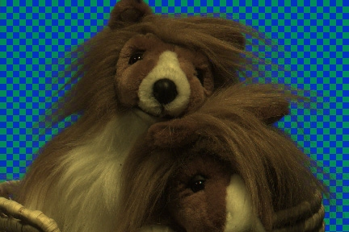
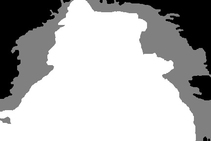
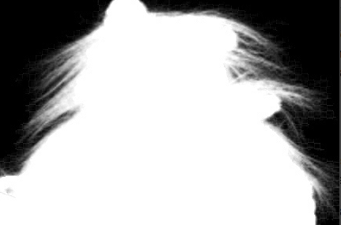
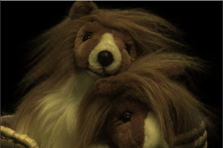

# Green Screen Matting

## An Implement of Green Screen Matting by Color Removal and Bayesian Matting

This is an implement of Green Screen Matting through two methods: One is directly remove the pixel whose rgb value is close to green, and the other uses bayesian matting of paper **"A Bayesian Approach to Digital Matting"**.

## Prerequisites

OpenCV 3.0+ and Eigen is required.

## images

* the image before matting



* the input trimap



* the output foreground mask



* the output foreground image



## Related paper

```
@article{Yung-Yu Chuang,
  title={A Bayesian Approach to Digital Matting},
  author={Yung-Yu Chuang, Brian Curless, David H. Salesin, Richard Szeliski2},
  journal={IEEE Computer Society Conference on Computer Vision and Pattern Recognition}, 
  year={2001},
  volume={2}, 
  number={4}, 
  pages={264-271}}
```

## Article

For more implement details, please refer to my article [贝叶斯估计、最大似然估计、最大后验概率与Baysian Matting](https://epsavlc.github.io/2018/12/22/baysian-matting.html)